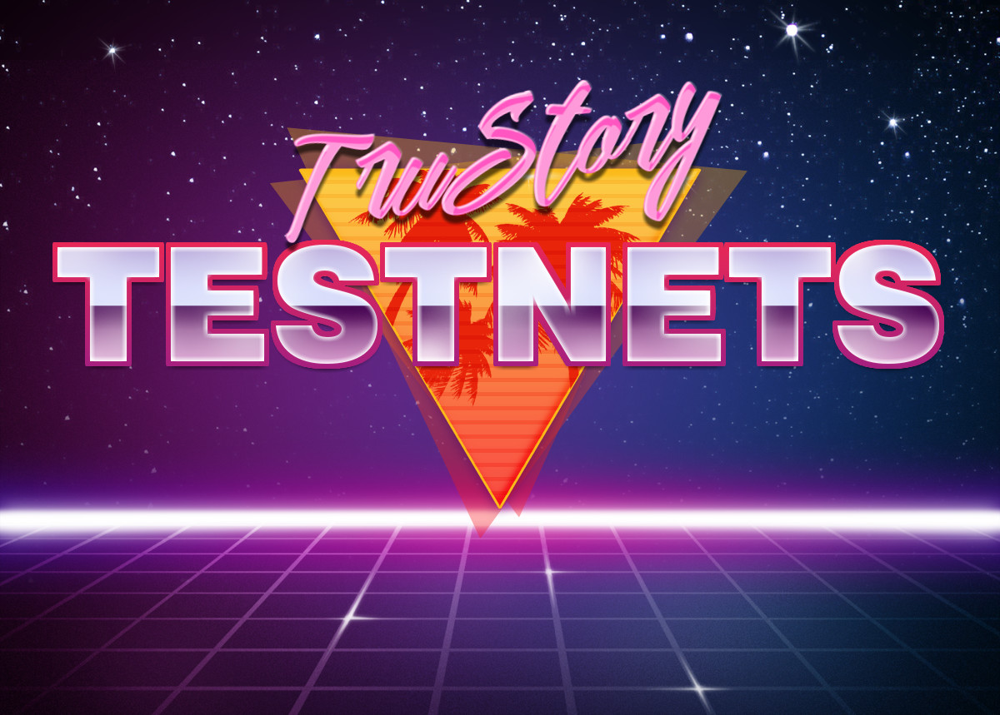

# ⚠️ Testnet-1 Update

Please update your binaries to the latest release [v0.4.0-beta](https://github.com/TruStory/truchain/releases/tag/v0.4.0-beta):
```sh
mkdir -p ~/bin
wget https://github.com/TruStory/truchain/releases/download/v0.4.0-beta/truchain-0.4.0-beta.tar.gz
tar xzvf truchain-0.4.0-beta.tar.gz -C ~/bin
```

Download the genesis file to your chain config directory:
```sh

```

## Overview

TruStory testnets will test the functionality of the [TruStory blockchain](https://github.com/TruStory/truchain) prior to the launch of mainnet. Validators who plan on joining the mainnet launch are strongly encouraged to participate in testnets.

To join a testnet, you must submit a [genesis transaction](https://github.com/TruStory/testnets#create-genesis-transaction) that creates your validator on the TruStory blockchain.

## How to run a validator on testnet

The latest testnet is [testnet-1](https://github.com/TruStory/testnets/tree/master/testnet-1).

### [Linux Setup](./linux.md)

### Install TruChain

Download Linux binaries:
```sh
mkdir -p ~/bin
wget https://github.com/TruStory/truchain/releases/download/v0.4.0-beta/truchain-0.4.0-beta.tar.gz
tar xzvf truchain-0.4.0-beta.tar.gz -C ~/bin
```

Alternatively, build from source:
```sh
git clone https://github.com/trustory/truchain
cd truchain && git checkout v0.4.0-beta
make install
```

Please build from source for non-Linux systems for now.

For full instructions, see [https://github.com/TruStory/truchain](https://github.com/TruStory/truchain).

### Create a wallet

```sh
# <name> is the name of your validator's account, i.e: validator
truchaincli keys add <name>
```
Make sure you save the mnemonic in a safe place!

### Create genesis transaction

```sh
# <moniker> is the name of your validator node
truchaind init --chain-id=testnet-1 <moniker> $(truchaincli keys show <name> -a)

# <name> is the name of validator's account (from above)
truchaind add-genesis-account $(truchaincli keys show <name> -a) 10000000000utru

# <node_ip_address> is the public IP address of your node
truchaind gentx --name <name> --amount 10000000000utru --ip <node_ip_address>
```

This generates a JSON file that contains the chain transaction that creates your validator with an allocation of 10,000 TRU. 
For example, check out the genesis transaction for [blockshane](https://github.com/TruStory/testnets/blob/master/testnet-1/gentx/gentx-267f9165a57da281721c3cf58adfeb9d506b7777.json). 

_The JSON in this example has been formatted to be human readable. It doesn't have to be formatted, but feel free to use a tool like [jq](https://stedolan.github.io/jq/) if you'd like to format yours as well._

### Submit genesis transaction

Submit a pull request with your gentx file added to the [testnet-1/gentx](https://github.com/TruStory/testnets/tree/master/testnet-1/gentx) directory.

Click "Fork" on top-right corner of page. Navigate to your fork, then:

```sh
# create a local clone
git clone https://github.com/<your-username>/testnets

# configure remote repo for your fork
cd testnets
git remote add upstream https://github.com/TruStory/testnets

# create a local branch
git checkout --branch <your-branch>

# copy over gentx file
cp ~/.truchaind/config/gentx/*.json testnet-1/gentx

# add changes to git
git add . && git commit -m "Added gentx for <your-validator-moniker>"

# push your branch
git push origin
```

[Submit a pull request](https://help.github.com/en/github/collaborating-with-issues-and-pull-requests/creating-a-pull-request-from-a-fork) to get your genesis transaction added.

## Next Steps

Await further instructions on joining the testnet when it launches.
